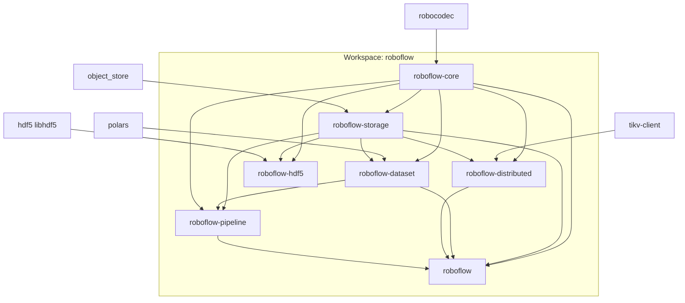

# Roboflow Workspace Restructuring Plan

## Current State Analysis

The codebase has grown organically with 12 feature flags and 208 conditional compilation blocks across 28 files. Key issues:

- **Feature proliferation**: `dataset-hdf5`, `dataset-parquet`, `dataset-depth`, `cloud-storage`, `distributed`, `tikv-catalog` create combinatorial complexity
- **Code duplication**: 41 `#[cfg(not(feature = ...))]` blocks with duplicate logic (especially in storage/dataset)
- **Implicit dependencies**: LeRobot requires parquet but not declared
- **Two TiKV integrations**: `distributed/tikv/` and `catalog/` with separate configs
- **Unnecessary cloud-storage feature**: S3/OSS is the production storage layer, not optional

## Target Architecture

### Crate Dependency Graph



**Note**: `roboflow-hdf5` is optional and not depended upon by the main crates. Users opt-in by adding it as a separate dependency.


### Mapping to Alibaba Cloud Deployment


| Cloud Component | Crate                                                          | Key APIs                                                            |
| --------------- | -------------------------------------------------------------- | ------------------------------------------------------------------- |
| Scanner Actor   | `roboflow-distributed`                                         | `acquire_scanner_lock()`, `submit_job()`, `list()`                  |
| Worker Pods     | `roboflow-storage`, `roboflow-distributed`, `roboflow-dataset` | `read_range()`, `claim_job()`, `checkpoint()`, `multipart_upload()` |
| API Server      | `roboflow-distributed`                                         | `list_jobs()`, `get_job()`, `cancel_job()`                          |
| OSS (S3)        | `roboflow-storage`                                             | Always available, no feature flag                                   |
| TiKV            | `roboflow-distributed`                                         | `TikvCoordinator` implementation                                    |


## Crate Structure

### 1. `roboflow-core` (no features, always compiled)

**Path**: `crates/roboflow-core/`

**Contents**:

- `RoboflowError` enum (without feature-gated variants)
- `Result<T>` type alias
- `CodecValue`, `DecodedMessage` re-exports from robocodec
- Common traits: `Decoder`, `Encoding` enum
- Configuration types: `NormalizeConfig`

**Key files to move**:

- `src/core/error.rs` → Remove `#[cfg(feature = "cloud-storage")]` variants, use string-based errors for extensibility
- `src/core/value.rs` → Direct re-export
- `src/core/registry.rs` → Type registry
- `src/config.rs` → Core configuration

### 2. `roboflow-storage` (no features, S3/OSS always available)

**Path**: `crates/roboflow-storage/`

**Design Philosophy**: S3/OSS is the production storage layer for distributed systems. Local filesystem is for development/testing only. No feature flags needed.

**Contents**:

- `Storage` trait (async-first)
- `LocalStorage` implementation (for dev/testing)
- `OssStorage` implementation (always available, production default)
- `CachedStorage`, `RetryingStorage` wrappers
- `StorageFactory`, `StorageUrl`
- Multipart upload support (always available)

**Required dependencies** (no optional):

```toml
[dependencies]
object_store = { version = "0.11", features = ["aws"] }  # Always included
tokio = { version = "1.40", features = ["rt-multi-thread", "sync"] }
url = "2.5"
bytes = "1.7"
```

**Key design change - async-first traits**:

```rust
// crates/roboflow-storage/src/traits.rs
#[async_trait]
pub trait Storage: Send + Sync {
    async fn read(&self, path: &Path) -> Result<Vec<u8>>;
    async fn read_range(&self, path: &Path, range: Range<u64>) -> Result<Vec<u8>>;
    async fn write(&self, path: &Path, data: &[u8]) -> Result<()>;
    async fn exists(&self, path: &Path) -> Result<bool>;
    async fn metadata(&self, path: &Path) -> Result<ObjectMetadata>;
    async fn list(&self, prefix: &Path) -> Result<Vec<ObjectMetadata>>;
    async fn delete(&self, path: &Path) -> Result<()>;
    
    // Multipart upload for large files (always available)
    async fn multipart_upload(&self, path: &Path) -> Result<Box<dyn MultipartUpload>>;
}

// Sync wrapper for compatibility (dev/testing only)
pub struct SyncStorage<S: Storage>(Arc<S>, Handle);
```

**No internal features** - everything is always compiled

### 3. `roboflow-distributed` (unified coordination)

**Path**: `crates/roboflow-distributed/`

**Contents** (merge `src/distributed/` and `src/catalog/`):

- Shared TiKV client with connection pooling
- Job coordination primitives
- Catalog metadata operations
- Distributed locks
- Heartbeat/health tracking
- Checkpoint state

**Key traits**:

```rust
// crates/roboflow-distributed/src/traits.rs
#[async_trait]
pub trait Coordinator: Send + Sync {
    // Job operations
    async fn claim_job(&self, file_hash: &str, pod_id: &str) -> Result<Option<JobRecord>>;
    async fn complete_job(&self, file_hash: &str) -> Result<()>;
    async fn fail_job(&self, file_hash: &str, error: &str) -> Result<()>;
    
    // Lock operations
    async fn acquire_lock(&self, resource: &str, owner: &str, ttl: Duration) -> Result<bool>;
    async fn release_lock(&self, resource: &str, owner: &str) -> Result<bool>;
    
    // Heartbeat
    async fn heartbeat(&self, pod_id: &str, status: &WorkerStatus) -> Result<()>;
    
    // Checkpoint
    async fn save_checkpoint(&self, state: &CheckpointState) -> Result<()>;
    async fn load_checkpoint(&self, file_hash: &str) -> Result<Option<CheckpointState>>;
}

#[async_trait]
pub trait Catalog: Send + Sync {
    // Episode metadata
    async fn save_episode(&self, metadata: &EpisodeMetadata) -> Result<()>;
    async fn get_episode(&self, id: &str) -> Result<Option<EpisodeMetadata>>;
    async fn list_episodes(&self, prefix: &str) -> Result<Vec<EpisodeMetadata>>;
    
    // Upload tracking
    async fn start_upload(&self, id: &str) -> Result<()>;
    async fn complete_upload(&self, id: &str) -> Result<()>;
    async fn get_upload_status(&self, id: &str) -> Result<UploadStatus>;
}
```

**Implementations**:

- `TikvCoordinator` - Production TiKV backend
- `InMemoryCoordinator` - Testing/development
- `NoopCoordinator` - Single-node fallback

### 4. `roboflow-dataset` (no features, parquet always available)

**Path**: `crates/roboflow-dataset/`

**Design Philosophy**: Parquet is the modern format for LeRobot v2.1 and production datasets. No feature flags needed.

**Contents**:

- `DatasetWriter` trait
- KPS Parquet writer
- LeRobot v2.1 writer
- Streaming conversion utilities
- Common types: `AlignedFrame`, `ImageData`, `WriterStats`
- Video encoding (MP4 via ffmpeg)
- Depth image encoding (PNG)

**Required dependencies** (no optional):

```toml
[dependencies]
polars = { version = "0.41", features = ["parquet"] }  # Always included
png = "0.17"  # For depth images
```

**Key change** - No features, no conditional fields:

```rust
// crates/roboflow-dataset/src/lerobot/writer.rs
pub struct LerobotWriter {
    storage: Arc<dyn Storage>,      // Always present
    config: LerobotConfig,
    // ... other fields without #[cfg] gates
}

impl LerobotWriter {
    pub async fn new(
        storage: Arc<dyn Storage>,
        output_prefix: String,
        config: LerobotConfig,
    ) -> Result<Self> {
        // Single code path, no conditional compilation
    }
}
```

### 4b. `roboflow-hdf5` (optional, separate crate for legacy support)

**Path**: `crates/roboflow-hdf5/`

**Design Philosophy**: HDF5 requires system library (libhdf5-dev) which complicates builds. Isolate in separate crate for users who need legacy KPS HDF5 format.

**Contents**:

- KPS HDF5 writer (legacy format)
- HDF5 schema definitions
- v1.2 HDF5 writer

**Dependencies**:

```toml
[dependencies]
roboflow-core = { path = "../roboflow-core" }
roboflow-storage = { path = "../roboflow-storage" }
hdf5 = { git = "https://github.com/archebase/hdf5-rs" }
```

**Usage**: Only included when explicitly depended upon:

```toml
# In user's Cargo.toml (optional)
[dependencies]
roboflow = "0.2"
roboflow-hdf5 = "0.2"  # Only if legacy HDF5 needed
```

### 5. `roboflow-pipeline` (processing orchestration)

**Path**: `crates/roboflow-pipeline/`

**Contents**:

- Pipeline orchestrator
- Stage implementations (reader, transform, compression, writer)
- Hyper pipeline (7-stage optimized)
- Dataset converter (direct conversion path)
- Fluent API (`Robocodec` builder)
- Hardware detection and auto-config

**Dependencies**:

- `roboflow-core`
- `roboflow-storage`
- `roboflow-dataset`
- `robocodec`

### 6. `roboflow` (facade crate)

**Path**: `crates/roboflow/`

**Contents**:

- Re-exports from all crates
- Feature flags for optional components
- Convenience presets

**Features** (minimal - only 2 features remain):

```toml
[features]
default = []

# Distributed coordination (TiKV backend)
distributed = ["dep:roboflow-distributed"]

# Python bindings
python = ["dep:pyo3", "robocodec/python"]
```

**What's always available** (no feature flags):

- S3/OSS storage via `roboflow-storage`
- Parquet datasets via `roboflow-dataset`
- LeRobot v2.1 format
- Video encoding, depth images

**What's separate** (optional crate):

- HDF5 legacy format via `roboflow-hdf5` crate (not a feature, separate dependency)

## Migration Strategy

### Phase 1: Create workspace structure (non-breaking)

1. Create `crates/` directory
2. Create `roboflow-core` with extracted core types (no features)
3. Update root `Cargo.toml` to workspace format
4. Keep original `src/` working via path dependencies

### Phase 2: Migrate modules incrementally

1. **roboflow-storage**: Move `src/storage/` with async-first traits, S3 always available
2. **roboflow-distributed**: Merge `src/distributed/` + `src/catalog/` with Coordinator trait
3. **roboflow-dataset**: Move `src/dataset/` (parquet always, no features)
4. **roboflow-hdf5**: Extract HDF5 writers to separate crate (isolates libhdf5)
5. **roboflow-pipeline**: Move `src/pipeline/`
6. Update imports and fix compilation

### Phase 3: Create facade crate

1. Create `roboflow` facade with re-exports
2. Only 2 features: `distributed`, `python`
3. Remove all `#[cfg(feature)]` from non-facade crates
4. Verify no conditional compilation in storage/dataset

### Phase 4: Cleanup and documentation

1. Remove dead code paths
2. Update CLAUDE.md and README
3. Add crate-level documentation
4. Update CI workflow (HDF5 in separate job)
5. Performance benchmarking

## CI/CD Updates

Update [.github/workflows/ci.yml](.github/workflows/ci.yml):

```yaml
jobs:
  # Core crates (fast, parallel, no system deps)
  test-core:
    strategy:
      matrix:
        crate: [roboflow-core, roboflow-storage, roboflow-dataset, roboflow-distributed]
    steps:
      - run: cargo test -p ${{ matrix.crate }}

  # HDF5 legacy crate (separate job, needs libhdf5)
  test-hdf5:
    steps:
      - run: sudo apt-get install -y libhdf5-dev
      - run: cargo test -p roboflow-hdf5

  # Integration tests
  test-integration:
    steps:
      - run: cargo test -p roboflow --features distributed
```

**Maximally simplified** - no feature permutations. HDF5 isolated to its own job.

## Key Files to Modify

- [Cargo.toml](Cargo.toml) → Convert to workspace manifest
- [src/lib.rs](src/lib.rs) → Facade re-exports
- [src/core/error.rs](src/core/error.rs) → Remove feature-gated variants
- [src/storage/mod.rs](src/storage/mod.rs) → Async trait definitions
- [src/distributed/tikv/client.rs](src/distributed/tikv/client.rs) → Implement `Coordinator` trait
- [src/catalog/](src/catalog/) → Merge into roboflow-distributed
- [src/dataset/lerobot/writer.rs](src/dataset/lerobot/writer.rs) → Remove conditional fields

## Risk Mitigation

- **API Breaking Changes**: Major version bump (0.2.0)
- **Backward Compatibility**: Keep facade crate API surface similar
- **Testing**: Each phase includes comprehensive test updates
- **Rollback**: Git branches for each phase enable rollback

## Expected Benefits


| Metric                   | Before              | After                                    |
| ------------------------ | ------------------- | ---------------------------------------- |
| Feature flags            | 12                  | 2 (distributed, python)                  |
| `#[cfg(feature)]` usages | 208                 | ~10 (distributed only)                   |
| Conditional code paths   | 41 duplicate blocks | 0                                        |
| Compile time (full)      | Baseline            | ~30% faster (parallel crate compilation) |
| Test isolation           | Monolithic          | Per-crate                                |
| Cloud storage setup      | Feature + env vars  | Just env vars (AWS_*/OSS_*)              |
| HDF5 builds              | Always linked       | Separate crate (opt-in)                  |


